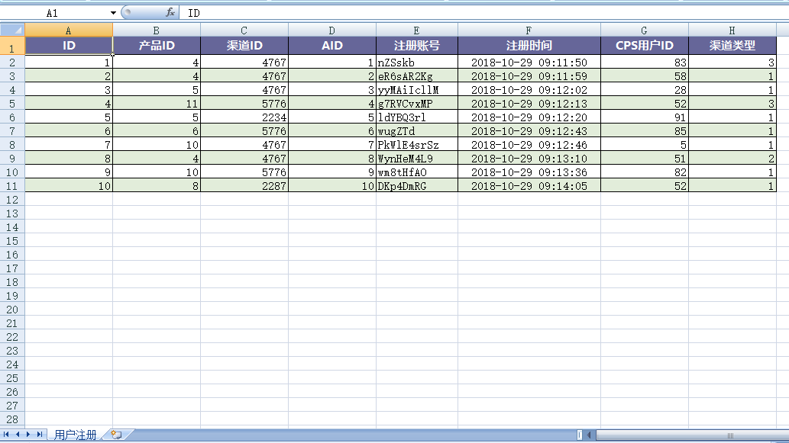
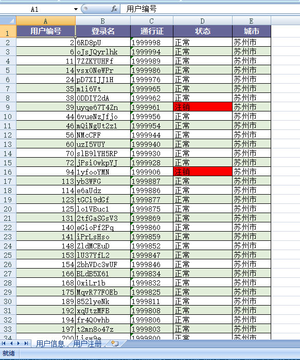
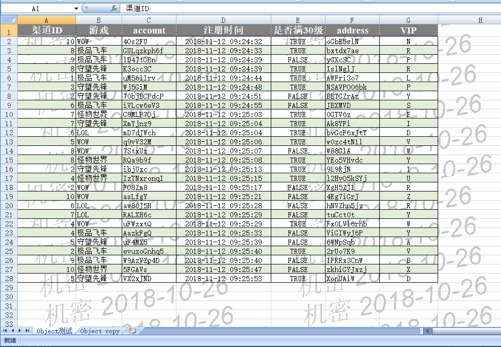

# eec介绍

eec（Excel Export Core）是一个Excel读取和写入工具，目前仅支持xlsx格式的导入导出。

与传统Excel操作不同之此在于eec执行导出的时候需要用户传入`java.sql.PreparedStatement`或`java.sql.ResultSet`，取数据的过程在eec内部执行，边读取游标边写文件，省去了将数据拉取到内存的操作也降低了OOM的可能。

eec并不是一个功能全面的excel操作工具类，它功能有限并不能用它来完全替代Apache POI，它最擅长的操作是表格处理。比如将数据库表导出为excel文档或者读取excel表格内容到stream或数据库。

## 主要功能

1. 支持`PreparedStatement`, `ResultSet`，导出行数无上限，如果数据量超过单个sheet上限会自动分页。（xlsx单sheet最大1,048,576行）
2. 支持 对象数组 和 Map数组 导出。
3. 可以为某列设置阀值高亮显示。如导出学生成绩时低于60分的单元格背景标黄显示。
4. int类型(byte,char,short,int)方便转可被识别文字
5. excel隔行变色
6. 设置列宽自动调节（功能未完善）
7. 设置水印（文字，本地＆网络图片）
8. ExcelReader采用stream方式读取文件，只有当你操作某行数据的时候才会执行读文件，而不会将整个文件读入到内存。
9. Reader支持iterator或者stream+lambda操作sheet或行数据，你可以像操作集合类一样读取并操作excel
10. Reader内置的to和too方法可以方便将行数据转换为对象（前者每次转换都会实例化一个对象，后者内存共享仅产生一个实例）

## 使用方法

导入eec.jar即可使用

```
git clone https://www.github.com/wangguanquan/ecc.git
mvn source:jar install
```

pom.xml添加


```
<dependency>
    <groupId>net.cua</groupId>
    <artifactId>eec</artifactId>
    <version>{eec.version}</version>
</dependency>
```

eec内部依赖dom4j.1.6.1和log4j.2.11.1如果目标工程已包含此依赖，使用如下引用

```
<dependency>
    <groupId>net.cua</groupId>
    <artifactId>eec</artifactId>
    <version>{eec.version}</version>
    <exclusions>
        <exclusion>
            <groupId>dom4j</groupId>
            <artifactId>dom4j</artifactId>
        </exclusion>
        <exclusion>
            <groupId>org.apache.logging.log4j</groupId>
            <artifactId>log4j-core</artifactId>
        </exclusion>
        <exclusion>
            <groupId>org.apache.logging.log4j</groupId>
            <artifactId>log4j-api</artifactId>
        </exclusion>
    </exclusions>
</dependency>
```

## 示例

### 导出示例，更多使用方法请参考test/各测试类

1. 无参SQL固定宽度导出测试,固定宽度20,也可以使用setWidth(int)来重置列宽

```
@Test public void t1() {
    try (Connection con = dataSource.getConnection()) {
        new Workbook("用户注册列表", creator) // 指定workbook名，作者
            .setAutoSize(true) // 列宽自动调节
            .addSheet("用户注册"
                , con.prepareStatement("select id,pro_id,channel_no,aid,account,regist_time,uid,platform_type from wh_regist limit 10"
                    , ResultSet.TYPE_FORWARD_ONLY, ResultSet.CONCUR_READ_ONLY)
                , new Sheet.Column("ID", int.class)
                , new Sheet.Column("产品ID", int.class)
                , new Sheet.Column("渠道ID", int.class)
                , new Sheet.Column("AID", int.class)
                , new Sheet.Column("注册账号", String.class)
                , new Sheet.Column("注册时间", Timestamp.class)
                , new Sheet.Column("CPS用户ID", int.class)
                , new Sheet.Column("渠道类型", int.class)
            ) // 添加一个sheet页
            .writeTo(defaultPath); // 指定输出位置
    } catch (SQLException | IOException | ExportException e) {
        e.printStackTrace();
    }
}
```

执行以上代码会在`f:\\excel`文件夹下生成一个《用户注册列表.xlsx》文件
内容如下图


2. SQL带参数测试，且将满足条件的单元格标红。如果某个列字符串重复率很高时可以将其设为共享达到数据压缩的目的。

```
@Test public void t2() {
    try (Connection con = dataSource.getConnection()) {
        boolean share = true;
        String[] cs = {"正常", "注销"};
        final Fill fill = new Fill(PatternType.solid, Color.red);
        new Workbook("多Sheet页-值转换＆样式转换", creator)
            .setAutoSize(true)
            .addSheet("用户信息"
                , con.prepareStatement("select id,name,account,status,city from t_user where id between ? and ? and city = ?"
                    , ResultSet.TYPE_FORWARD_ONLY, ResultSet.CONCUR_READ_ONLY)
                , p -> {
                    p.setInt(1, 1);
                    p.setInt(2, 500);
                    p.setString(3, "苏州市");
                } // 设定SQL参数
                , new Sheet.Column("用户编号", int.class)
                , new Sheet.Column("登录名", String.class) // 登录名都是唯一的可以不设共享
                , new Sheet.Column("通行证", String.class)
                , new Sheet.Column("状态", char.class, c -> cs[c], share) // 将0/1用户无感的数字转为文字，并共享字串
                    .setStyleProcessor((n, style, sst) -> {
                        if ((int) n == 1) { // 将注销的用户标记
                            style = Styles.clearFill(style) | sst.addFill(fill); // 注销标红
                        }
                        return style;
                    })
                , new Sheet.Column("城市", String.class, share) // 共享字串
            )
            .addSheet("用户注册"
                , con.prepareStatement("select id,pro_id,channel_no,aid,account,regist_time,uid,platform_type from wh_regist limit 10"
                        , ResultSet.TYPE_FORWARD_ONLY, ResultSet.CONCUR_READ_ONLY)
                , new Sheet.Column("ID", int.class)
                , new Sheet.Column("产品ID", int.class)
                , new Sheet.Column("渠道ID", int.class)
                , new Sheet.Column("AID", int.class)
                , new Sheet.Column("注册账号", String.class)
                , new Sheet.Column("注册时间", Timestamp.class)
                , new Sheet.Column("CPS用户ID", int.class)
                , new Sheet.Column("渠道类型", int.class)
            )
            .writeTo(defaultPath); // 输出到output，如果是web导出功能这里可以直接输出到｀response.getOutputStream()｀
    } catch (SQLException | IOException | ExportException e) {
        e.printStackTrace();
    }
}
```

Excel如下图


3. 对象数组 & Map数组支持。对象可以通过注解@DisplayName来设置表头列或共享，敏感信息使用@NotExport来指定不导出的字段。

```
/**
 * 测试对象
 */
public class TestExportEntity {
    @DisplayName("渠道ID")
    private int channelId;
    @DisplayName(value = "游戏", share = true)
    private String pro;
    @DisplayName
    private String account;
    @DisplayName("注册时间")
    private Timestamp registered;
    @DisplayName("是否满30级")
    private boolean up30;
    @NotExport("敏感信息不导出")
    private int id; // not export
    private String address;
    @DisplayName("VIP")
    private char c;
}

@Test public void t3() {
    // test datas
    List<TestExportEntity> objectData = new ArrayList<>();
    int size = random.nextInt(100) + 1;
    String[] proArray = {"LOL", "WOW", "极品飞车", "守望先锋", "怪物世界"};
    long start = System.currentTimeMillis();
    TestExportEntity e;
    while (size-->0) {
        e = new TestExportEntity();
        e.id = size;
        e.channelId = random.nextInt(10) + 1;
        e.pro = proArray[random.nextInt(5)];
        e.account = getRandom();
        e.registered = new Timestamp(start += random.nextInt(8000));
        e.up30 = random.nextInt(10) > 3;
        e.address = getRandom();
        e.c = (char) ('A' + random.nextInt(26));
        objectData.add(e);
    }
    // test datas end
    
    // 设置边框
    Border border = new Border();
    border.setBorder(BorderStyle.DOTTED, Color.red);
    border.setBorderBottom(BorderStyle.NONE);
    // 设置填充
    Fill fill = new Fill();
    fill.setPatternType(PatternType.solid);
    fill.setFgColor(Color.GRAY);
    fill.setBgColor(Color.decode("#ccff00"));
    // 设置字体
    Font font = new Font("Klee", 14, Font.Style.bold, Color.white);
    font.setCharset(Charset.GB2312); // 字符集
    
    Workbook wb = new Workbook("对象数组测试", creator)
        .setAutoSize(true) // Auto-size
        .setWaterMark(WaterMark.of("机密 2018-10-26")) // 设置水印
        .addSheet("Object测试", objectData)  //  方式1
        .addSheet("Object copy", objectData  // 方式2，方式2可以重置列顺序和进行转换，方式1的列顺序与对象Filed定义顺序一致
            , new Sheet.Column("渠道ID", "id")//.setType(Sheet.Column.TYPE_RMB) // 设置RMB样式
            , new Sheet.Column("游戏", "pro")
            , new Sheet.Column("账户", "account")
            , new Sheet.Column("是否满30级", "up30")
            , new Sheet.Column("渠道", "channelId", n -> n < 5 ? "自媒体" : "联众", true)
            , new Sheet.Column("注册时间", "registered")
        );
    // 改变某个Sheet的头部样式
    wb.getSheet("Object测试").setHeadStyle(font, fill, border); 
    try {
        wb.writeTo(Paths.get("f:\\excel"));
    } catch (IOException | ExportException ex) {
        ex.printStackTrace();
    }
}
```

结果如下



4. 有时候你可能会使用模板来规范格式，不固定的部分使用${key}标记，Excel导出时使用Map或者Java bean传入。

如有以下格式模板文件template.xlsx

>                       通知书
>     ${name } 同学，在本次期末考试的成绩是 ${score}。
>                                 ${date }

测试代码

```
@Test public void t4() {
    try (FileInputStream fis = new FileInputStream(new File(defaultPath.toString(), "template.xlsx"))) {
        // Map data
        Map<String, Object> map = new HashMap<>();
        map.put("name", "guanquan.wang");
        map.put("score", 90);
        map.put("date", "2018-02-12 12:22:29");

        // java bean
//        BindEntity entity = new BindEntity();
//        entity.score = 67;
//        entity.name = "张三";
//        entity.date = new Timestamp(System.currentTimeMillis());

        new Workbook("模板导出", creator)
            .withTemplate(fis, map) // 绑定模板
            .writeTo(Paths.get("f:\\excel")); // 写到某个文件夹
    } catch (IOException | ExportException e) {
        e.printStackTrace();
    }
}
```

### 读取示例

1. 使用iterator迭代每行数据

```
/**
 * 使用iterator遍历所有行
 */
@Test public void t4() {
    try (ExcelReader reader = ExcelReader.read(defaultPath.resolve("单Sheet.xlsx"))) {
        // Get first sheet
        Sheet sheet = reader.sheet(0);

        for (
            Iterator<Row> ite = sheet.iterator();
            ite.hasNext();
            System.out.println(ite.next())
        );
    } catch (IOException e) {
        e.printStackTrace();
    }
}
```

2. 使用stream操作

```
@Test public void t5() {
    try (ExcelReader reader = ExcelReader.read(defaultPath.resolve("用户注册.xlsx"))) {
        reader.sheets().flatMap(Sheet::rows).forEach(System.out::println);
    } catch (IOException e) {
        e.printStackTrace();
    }
}
```

3. 将excel读入到数组或List中

```
/**
 * read excel to object array
 */
@Test public void t6() {
    try (ExcelReader reader = ExcelReader.read(defaultPath.resolve("用户注册.xlsx"))) {
        Regist[] array = reader.sheets() // 所有worksheet
            .flatMap(Sheet::dataRows) // 去掉表头和空行
            .map(row -> row.to(Regist.class)) // 将每行数据转换为Regist对象
            .toArray(Regist[]::new);
        // do...
    } catch (IOException e) {
        e.printStackTrace();
    }
}
```

4. 当然既然是stream那么就可以使用流的全部功能，比如加一些过滤等。

```
reade.sheets()
    .flatMap(Sheet::dataRows)
    .map(row -> row.to(Regist.class))
    .filter(e -> "iOS".equals(e.platform()))
    .collect(Collectors.toList());
```

以上代码相当于`select * from 用户注册 where platform = 'iOS'`


## CHANGELOG

Version 0.2.8 (2018-11-24)
-------------
1.对象数组导出时包装类报类型转换错误bug
2.对象数组导出类型为java.util.date时类型转换错误
3.ExcelReader开放cacheSize和hotSize两个参数，用户可以根据实际情况重置参数以减少文件读取次数，以空间换取时间提交读取速度
4.暂时取消setConnection方法的过时标记
5. 修改超过676列时Export会出现位置错误的BUG
6. 修改列数据过多时Reader出现死循环的BUG

Version 0.2.7 (2018-11-19)
-------------
1. sharedString保留一个顺序流句柄以减少读文件次数
2. Sheet增加isHidden, isShow方法，读取Excel时可以通过Filter过滤掉隐藏或显示的worksheet
   `reader.sheets().filter(Sheet::isShow).flatMap(Sheet::rows).forEach(System.out::println)`
3. BigDecimal类型支持
4. LocalDate,LocalDateTime,LocalTime,java.sql.Time类型支持
5. 增加读写转义（跳过不可见字符ASCII 0~31）
6. setConnection方法被标记过时，将在0.3.x版本中删删除。传入一个数据库连接是一种不安全行为，
   第三方可能利用此连接做其它非法的数据库操作

[更多...](./CHANGELOG)

## TODO LIST

1. excel文件增加导出scripts功能
2. list data with template
3. 对excel文件设置密码 (AES-128 encrypted)
4. 多线程支持，多个sheet数据同时写
5. 自动列宽要考虑字体样式实现
6. SharedString增加热词区块提高命中率
7. wiki for eec
8. 读取colspan/rowspan单元格
